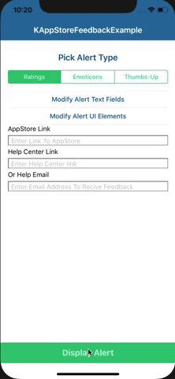

# KAppStoreFeedback
Simple way to collect user feedback and navigate to AppStore if positive review else to help center/support email.



## Feature
- Send feedback by mail
- Send feedback to help center link
- Send feedback to AppStore
- Three modes of feedback with customizable UI

## Requirements
- iOS11.0+
- Xcode 9+

## Installation
### CocoaPods
[CocoaPods](http://cocoapods.org) is a dependency manager for Cocoa projects. You can install it with the following command:

```bash
$ gem install cocoapods
```

To integrate FeedbackKit into your Xcode project using CocoaPods, specify it in your `Podfile`:

```ruby
platform :ios, '11.0'
use_frameworks!

pod 'KAppStoreFeedback'
```

Then, run the following command:

```bash
$ pod install
```

## Usage (Required)
### Initialize KAppStoreFeedback on any Viewcontroller desired to show the alert 

Copy paste below code

```swift
import KAppStoreFeedback

override func viewDidLoad() {
    super.viewDidLoad()
    KAppStoreFeedBackView.shared.initializeKAppStoreFeedBackView(hostingViewController: self, navigationConfig: getKAppStoreFeedbackNavigationConfig(), config: getKAppStoreFeedbackConfig(), configUIElements: nil)
}

func getKAppStoreFeedbackConfig () -> KAppStoreFeedbackConfig {
    return KAppStoreFeedbackConfig(kASFFeedbackType: KAppStoreFeedbackType.ratingsView, minimumLoginAttempt: 10)
}

func getKAppStoreFeedbackNavigationConfig () -> KAppStoreFeedbackNavigationConfig {
    return KAppStoreFeedbackNavigationConfig(iTunesLink: "my App store link", helpEmail: "help email used if help link not provided ", helpLink: "URL to support page or Ticketing page", callBackdelegate: nil)
}

```

## Usage (Optional - Customization)

### To switch between feedback alert types - 
Replace getKAppStoreFeedbackConfig() method for desired alert type

#### Alert Rating view type - KAppStoreFeedbackType.ratingsView
```swift

func getKAppStoreFeedbackConfig () -> KAppStoreFeedbackConfig  {
    return KAppStoreFeedbackConfig(kASFFeedbackType: KAppStoreFeedbackType.ratingsView, minimumLoginAttempt: 10)
}
```
#### Alert emoticons view type - KAppStoreFeedbackType.emoticonsView
```swift

func getKAppStoreFeedbackConfig () -> KAppStoreFeedbackConfig  {
return KAppStoreFeedbackConfig(kASFFeedbackType: KAppStoreFeedbackType.emoticonsView, minimumLoginAttempt: 10)
}
```
#### Alert thumbs view type - KAppStoreFeedbackType.thumbsView
```swift

func getKAppStoreFeedbackConfig () -> KAppStoreFeedbackConfig {
return KAppStoreFeedbackConfig(kASFFeedbackType: KAppStoreFeedbackType.thumbsView, minimumLoginAttempt: 10)
}
```

### To customize UI look and feel  
Please create on KAppStoreFeedbackUIElementsConfig object and pass during initialize 

```swift

func getKAppStoreFeedbackUIElementsConfig () -> KAppStoreFeedbackUIElementsConfig {
    let myColor = UIColor.gray
    let myFont = UIFont.systemFont(ofSize: 20.0)

    return  KAppStoreFeedbackUIElementsConfig(alertBackgroundColor: myColor,
                                alertBorderColor: myColor,
                                alertTitleBackgroundColor: myColor,
                                alertTitleFontColor: myColor,
                                alertMessageFontColor: myColor,
                                alertNotNowButtonFontColor: myColor,
                                alertRateButtonFontColor: myColor,
                                alertHelpButtonFontColor: myColor,
                                alertCornerRadius: 10 ,
                                alertTitleFont: myFont,
                                alertMessageFont: myFont,
                                alertSecondryButtonFont: myFont,
                                alertPrimaryButtonFont: myFont)
}

```
### To customize navigation of feedback interaction   
 Please create on KAppStoreFeedbackNavigationConfig object and pass during initialize 

#### Link Approch 
```swift

func getKAppStoreFeedbackNavigationConfig () -> KAppStoreFeedbackNavigationConfig {
    return KAppStoreFeedbackNavigationConfig(iTunesLink: "my App store link", 
                            helpEmail: "help email used if help link not provided ",
                            helpLink: "URL to support page or Ticketing page",
                            callBackdelegate: nil)
}
```
#### Delegate / Callback Approch

```swift

func getKAppStoreFeedbackNavigationConfig () -> KAppStoreFeedbackNavigationConfig {
        return  KAppStoreFeedbackNavigationConfig(iTunesLink: nil, helpEmail: nil, helpLink: nil, callBackdelegate: self)
}

//MARK:- KAppStoreFeedbackProtocol

func navigateToPossitiveFeedBackHandler() {
    TODO: handle possitive interaction 
}

func navigateToNegativeFeedBackHandler() {
    TODO: Handle negetive interaction
}

```

### To customize text in feedback alert  
Please create on KAppStoreFeedbackConfig object and pass during initialize 

```swift

func getKAppStoreFeedbackConfig () -> KAppStoreFeedbackConfig {
    return  KAppStoreFeedbackConfig(kASFFeedbackType: KAppStoreFeedbackType.emoticonsView ,
                                title: "Custom Title",
                                message: "Custom Message",
                                notNowButtonTitle: "Not now text",
                                rateButtonTitle: "Rate button text",
                                helpButtonTitle: "help button text",
                                minimumLoginAttempt: 10)
}
```
